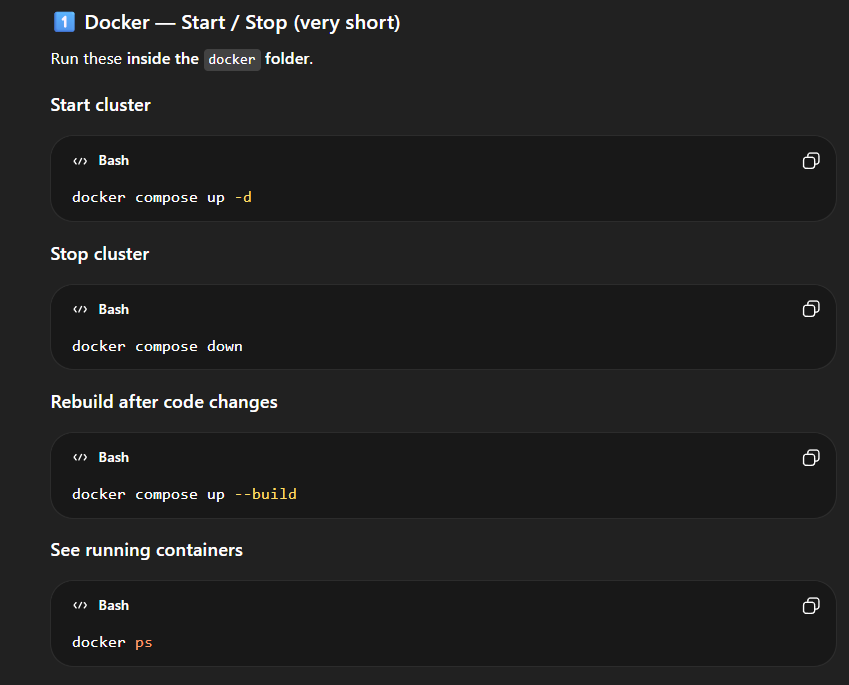

# COSMEON FS-LITE

COSMEON FS-LITE is an educational distributed file system, with 2 major improvements: 
- Access Pattern Adaptive Replication, &
- Self-Healing Merkle Repair.
It is also a simulator that demonstrates how systems like HDFS, Ceph, and S3 store data internally.  
Files are split into chunks, distributed across multiple storage nodes, and reconstructed on request.  
The system includes a Next.js orchestrator, simulated storage nodes, and real-time cluster observability.  
It runs locally using Docker to emulate a distributed storage cluster.

---

## Setup

### 1. Clone the repository

git clone https://github.com/yourusername/cosmeon-fs-lite.git  
cd cosmeon-fs-lite

---

### 2. Install dependencies

Install Node.js (v18+)

Install Bun  
https://bun.sh

Install Docker Desktop  
https://www.docker.com/products/docker-desktop/

---

### 3. Install orchestrator dependencies

cd orchestrator  
npm install

---

### 4. Start storage cluster

cd ../docker  
docker compose up -d

---

### 5. Start orchestrator

cd ../orchestrator  
npm run dev

---

The cluster nodes will run on:

ORBIT-1 → http://localhost:4001  
ORBIT-2 → http://localhost:4002  
ORBIT-3 → http://localhost:4003  
ORBIT-4 → http://localhost:4004  
ORBIT-5 → http://localhost:4005

## More help with docker:
